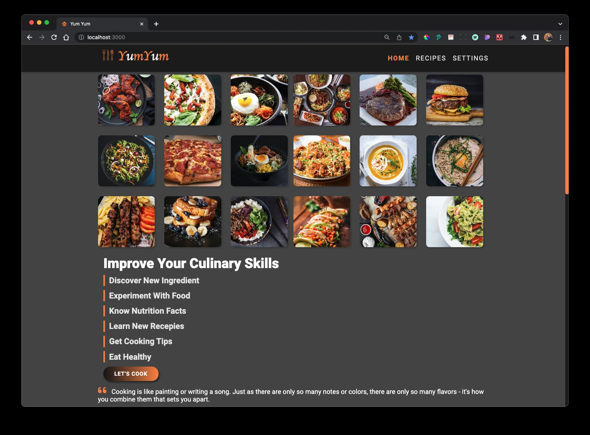

# Yum Yum

#### A food recipies website deployed on Vercel.com

### https://yum-yum-caeserlondon.vercel.app/

#### build with:

#### React V 18.1.0, React Router Dom: V 6.3.0,SASS , fonte-awesome, splide slider, React-icons,

#### Using API from https://spoonacular.com

#### Using animation and sliders.

#### Search any recipe, ingredient or cusine!

#### Change the theme and change the colors, font size and animation speed!

#### Custom 404 page and 402 pages

